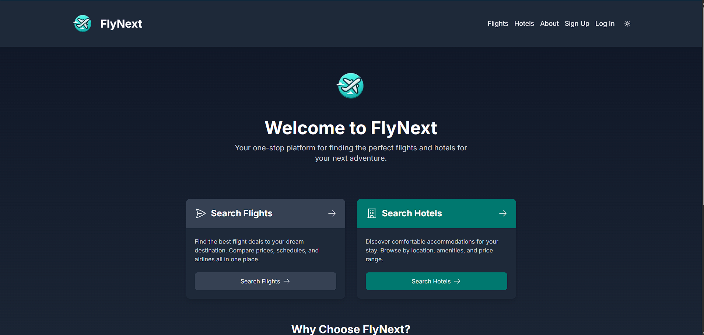

FlyNext: Your Most Reliable Travel Companion
============================================



FlyNext is a comprehensive travel search platform developed for the CSC309 Programming on the Web course at the University of Toronto Mississauga, Winter 2025. It streamlines booking flights and hotels through a responsive, single-page web application with an intuitive interface. FlyNext integrates real-time flight data from the Advanced Flights System (AFS) and manages hotel and booking data locally, offering features like advanced search filters, secure JWT authentication, and itinerary management. The application is deployed to the internet and optimized for production use.

This repository contains the complete implementation of FlyNext, including the Next.js backend, React frontend, and PostgreSQL database.

Project Overview
----------------

FlyNext enables users to:

-   Search and book flights (one-way or round-trip) and hotels with advanced filtering (price, star rating, amenities, etc.).
-   Manage hotel listings and room types as hotel owners.
-   Handle bookings, cancellations, and notifications.
-   Enjoy a responsive, intuitive interface with dark/light mode and cross-device compatibility.
-   Access a pre-populated database with at least 50 hotels for a realistic experience.

The application is built with modern web technologies and deployed at [https://flynext-raj.vercel.app](https://flynext-raj.vercel.app/).

### Technologies Used

-   **Backend**: Next.js, Prisma, REST, JWT for authentication, TypeScript
-   **Frontend**: React, TailwindCSS, TypeScript
-   **Database**: PostgreSQL
-   **External Integration**: Advanced Flights System (AFS) APIs
-   **Other Tools**: Postman, Swagger, Node.js 20+

Setup Instructions (Local Development)
--------------------------------------

### Prerequisites

-   Node.js 20+
-   PostgreSQL (installed and running locally)
-   Git

### Installation and Running

1.  **Clone the Repository**:

    ```
    git clone <your-gitlab-repo-url>
    cd flynext

    ```

2.  **Install Dependencies**:

    ```
    npm install

    ```

3.  **Set Up the Database**:

    -   Run Prisma migrations to set up the database schema:

        ```
        npx prisma migrate dev

        ```

    -   Populate the database with pre-populated hotel data (at least 50 hotels) by running the data import script (if provided) or manually seeding via Prisma.

4.  **Start the Application**:

    -   Run the application in development mode:

        ```
        npm run dev

        ```

    -   The application will be accessible at `http://localhost:3000`.

5.  **Test APIs**:

    -   Import `postman_collection.json` into Postman to test the REST APIs.
    -   Import `collection.openapi` into Swagger Editor (<https://editor.swagger.io/>) for API documentation.
    -   Refer to `docs.pdf` for the database model design and ER diagram.
6.  **Access the Deployed Application**:

    -   The application is hosted at [https://flynext-raj.vercel.app](https://flynext-raj.vercel.app/).

Project Structure
-----------------

```
flynext/
├── app/                    # Next.js API routes and pages
├── components/             # React components
├── prisma/                 # Prisma schema and migrations
├── public/                 # Static assets
├── scripts/                # Shell scripts (e.g., data import scripts)
├── postman_collection.json # Postman API collection
├── collection.openapi      # Swagger API documentation
├── docs.pdf                # Database model documentation
├── url.txt                 # Deployed application URL
├── .env                    # Environment variables
├── package.json            # Node.js dependencies
└── README.md               # This file

```

API Documentation
-----------------

The REST API endpoints are documented in `postman_collection.json` and `collection.openapi`. These cover:

-   User authentication (sign-up, login, logout, profile editing).
-   Flight search and booking (via AFS, including cancellation).
-   Hotel management (add/edit hotels, room types, availability).
-   Booking management (create, view, cancel).
-   Notifications (new bookings, cancellations).

The frontend interacts with these APIs to provide a seamless user experience.

Database Models
---------------

Refer to `docs.pdf` for a detailed explanation of the database models, including:

-   **User**: Stores user information (first name, last name, email, phone, profile picture).
-   **Hotel**: Stores hotel details (name, logo, address, location, star rating, images).
-   **RoomType**: Stores room types for each hotel (name, amenities, price, images).
-   **Booking**: Stores itinerary details (flights and/or hotel reservations).
-   **Notification**: Stores user and hotel owner notifications.
-   **City/Airport**: Stores AFS-fetched data for search autocomplete.

The schema is implemented in PostgreSQL, with migrations managed by Prisma.

Contributions
-------------

-   **Aaron Li**: Architected and implemented robust API endpoints for hotel management, ensuring seamless hotel creation, room type management, and availability updates. Spearheaded containerization efforts with Docker to enhance portability and scalability. Configured and deployed HTTPS to secure web traffic and ensure encrypted communication."


-   **Julius Henriques**: Designed and developed API endpoints for user account management and notifications, delivering a smooth authentication flow and real-time notification system. Crafted an engaging and responsive frontend with React and TailwindCSS, seamlessly integrating it with the backend to provide a cohesive user experience.

-   **Raymond Nguyen**: Engineered API endpoints for flight search, booking, and hotel management, enabling efficient integration with the Advanced Flights System (AFS). Led the successful migration of the entire codebase to TypeScript, achieving 100% type safety to enhance code reliability and maintainability.

Deployment
----------

The application is deployed at [https://flynext-raj.vercel.app](https://flynext-raj.vercel.app/) using Vercel. For local testing, run the application using `npm run dev` as described above.


*This project was developed for CSC309: Programming on the Web, University of Toronto Mississauga, Winter 2025.*
